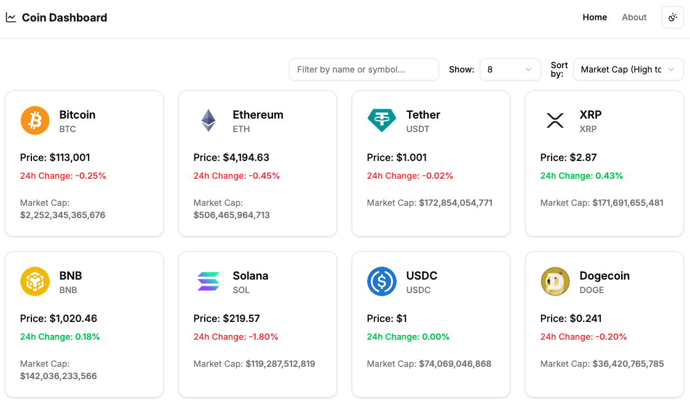

# 🪙 Crypto Dashboard

A modern crypto dashboard application built with **React Router**, designed to display real-time cryptocurrency data with detailed coin pages, charts, filtering, sorting, and responsive UI.



## ✨ Features

- 📊 **Live crypto market data** from the [CoinGecko API](https://www.coingecko.com/en/api).
- 🔍 **Filtering, sorting, and pagination** for browsing coins.
- 📈 **Interactive charts** (7-day price history).
- 🧩 **Detailed coin view** with price stats, market cap, supply info, all-time highs/lows, and useful links.
- 🖼️ **Skeleton loading states** for better UX.
- 🎨 **Responsive design** using Tailwind CSS and [shadcn/ui](https://ui.shadcn.com/).
- ⚡️ Hot Module Replacement (HMR).
- 🔒 Built with **TypeScript** for type safety.

## 🛠️ Tech Stack

- **React Router** – routing & data loading
- **TypeScript** – static typing
- **Tailwind CSS** – utility-first styling
- **shadcn/ui** – accessible UI components
- **Chart.js** + `react-chartjs-2` – charts
- **Vite** – fast build & dev environment
- **CoinGecko API** – crypto data provider
- **Docker** – deployment-ready containerization

## 🚀 Getting Started

### Installation

```bash
npm install
```

## Development

Run the dev server with HMR:

```bash
npm run dev
```

App will be available at http://localhost:5173.

## Build for Production

```bash
npm run build
```

## Preview Production Build

```bash
npm run preview
```

# 📖 Styling
	•	Tailwind CSS is preconfigured.
	•	shadcn/ui components for consistent and accessible design.
	•	Customize or extend as needed.
